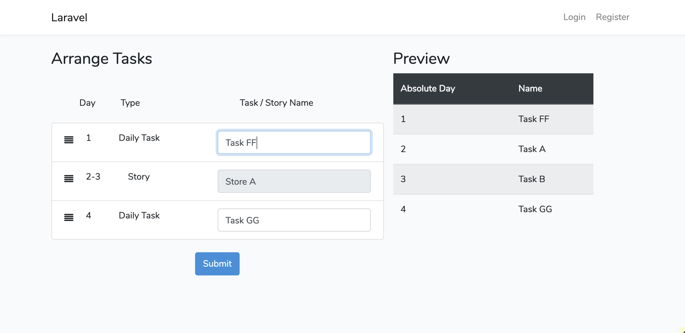

## Preview
 


# Installation

- install the package

`composer install`

- Copy the .env file

`cp -r .env.example .env`

- Migrate Database

`php artisan migrate`

- Seed Database:

`php artisan db:seed`

- Frontend compile
```
npm install
npm run dev
```

- Start server

`php artisan serve`

then visit `http://127.0.0.1:8000`